import { Tabs, Tab } from 'nextra-theme-docs';

# 🏴‍☠️ generate_snark.py — Neon-Slick Snark Cannon

<blockquote>
  <strong>Absolutely gaudy, NSFW, emoji-saturated, rainbow-vomiting snark-commit generator.</strong>
  <br />
  Fabricate historical commits drenched in pirate sass, consensual rope-play metaphors, and retina-melting ANSI colors. Use it only for demos, art, and consenting glitter goblins — never to impersonate real work.
</blockquote>

<Callout type="warning" emoji="⚠️">
Safe word reminder: <em>“fiction.”</em> Never weaponize fabricated history without consent.
</Callout>

## 🌈 Feature Striptease

- Generates `N` commits with randomized messages, timestamps, and blame tags.
- Supports day-by-day or week-wise spreading, weekday-only planning, and weighted months.
- Preview mode prints a rainbow heatmap + histogram, exports JSON, and optional SVG.
- Import a preview JSON later to replay the exact choreographed commit queue.
- Fully colorized output with `--no-color` grayscale aftercare available.
- Slots-powered dataclasses and other Python 3.12+ delights for maximum sheen.

## 🛠️ Requirements & Setup

- **Python 3.12+** (the script slurps up `datetime.UTC`, `argparse.BooleanOptionalAction`, and other modern toys).
- An existing git repository with a branch you’re comfortable desecrating.
- Optional but spicy: `ruff` for formatting.

<Tabs items={["Setup", "Upgrade"]}>
  <Tab>
    ```bash
    python3.12 -m pip install --upgrade ruff
    chmod +x generate_snark.py
    ```
  </Tab>
  <Tab>
    ```bash
    # Use your package manager of choice to install Python 3.12+
    pyenv install 3.12.4
    pyenv local 3.12.4
    ```
  </Tab>
</Tabs>

### Optional: Auto-Snark Git Hook

Ensure every commit exits with a consensual flourish:

```bash
rm -f .git/hooks/prepare-commit-msg
ln -s ../../hooks/prepare-commit-msg .git/hooks/prepare-commit-msg
chmod +x .git/hooks/prepare-commit-msg
```

If symlinks make security blush, copy instead:

```bash
cp hooks/prepare-commit-msg .git/hooks/prepare-commit-msg
chmod +x .git/hooks/prepare-commit-msg
```

Voilà—commit messages now pull from the 1000+ kink-positive snark vault.

Prefer version-controlled hooks? Point Git at the fancy ones without copying:

```bash
chmod +x hooks/prepare-commit-msg
git config core.hooksPath hooks
```

Git will happily execute the repo’s `hooks/` directory on every commit.

## 🚀 Quick Start Fantasia

### Preview Without Touching Git History

```bash
python3.12 generate_snark.py -n 50 --preview-only --svg-out preview.svg
```

Expect:

- Summary stats
- Rainbow heatmap + histogram
- Top 20 planned commits
- JSON export (`planned_commits_preview_<timestamp>.json`)
- Optional SVG heatmap if `--svg-out` joined the party

### Commit For Real (Demo Branch Only, darling)

```bash
python3.12 generate_snark.py \
  -n 120 \
  --repo . \
  --file .generated_commits.txt \
  --spread-mode week \
  --start-date 2024-01-01 \
  --end-date 2024-12-31
```

The script appends log entries to `.generated_commits.txt`, stages them, and creates commits with historical timestamps spaced within ±8 hours.

## 🎨 Spectacle Gallery (aka: commit couture runway)

Ready-made visual fireworks so you can flaunt the chaos before you even run the script.

<Tabs items={["Terminal Heatmap", "SVG Fever", "JSON Statuette"]}>
  <Tab>

```text
🌈 RAINBOW HEATMAP (older → newer, 28 days)

Mon ░░░░░░██████████████████░░
Tue ░░███▓▓▓██████▓▓▓▓▓███░░░
Wed ░▓▓▓▓██████████▓▓▓▓▓▓░░░
Thu ░░░██████▓▓▓▓▓▓▓███░░░░░
Fri ░░░░██▓▓▓███▓▓▓▓▓██░░░░░
Sat ░░░░░░░░░░░░░░░░░░░░░░░░
Sun ░░░░░░░░░░░░░░░░░░░░░░░░

  ‾    ‾    ‾    ‾    ‾    ‾
```

  </Tab>
  <Tab>

```svg
<svg width="420" height="120" viewBox="0 0 420 120" xmlns="http://www.w3.org/2000/svg">
  <rect width="100%" height="100%" fill="#0b0b0b" />
  <g transform="translate(16,16)">
    <rect x="0" y="0" width="18" height="18" rx="3" fill="#ff4d4d" />
    <rect x="22" y="0" width="18" height="18" rx="3" fill="#ffd24d" />
    <rect x="44" y="0" width="18" height="18" rx="3" fill="#8a2be2" />
    <rect x="66" y="0" width="18" height="18" rx="3" fill="#eeeeee" />
    <text x="0" y="60" fill="#fff" font-size="14" font-family="monospace">
      🌈 4-week dopamine flood — share responsibly.
    </text>
  </g>
</svg>
```

  </Tab>
  <Tab>

```json
{
  "commits": [
    {
      "author_date_iso": "2025-05-17T16:12:44+00:00",
      "committer_date_iso": "2025-05-17T12:24:02+00:00",
      "chosen_day": "2025-05-17",
      "message": "💫 Test: Reprimanded the race condition with a stern log. 🏁🗣️ (flux.py::render_photon) @ops — commit 42/69"
    }
  ],
  "generated_at_utc": "2025-05-18T00:02:13Z",
  "repo": "/path/to/hemorrhaging-glitter",
  "target_file": ".generated_commits.txt"
}
```

  </Tab>
</Tabs>

<Callout type="info" emoji="🪄">
Hot tip: drop the SVG straight into README.md for instant dopamine, or animate the terminal heatmap with [asciinema](https://asciinema.org/) to really sear eyeballs.
</Callout>

## 📈 Hyper-Saturated Metrics Dashboard

| Metric | Mood | Interpretation |
|--------|------|----------------|
| `🔥 Spiciness Index` | 9.5 / 10 | Commit messages practically flirting with HR. |
| `🌊 Timewarp Drift` | 6h avg | Typical delta between author & committer timestamps. |
| `📅 Month Swagger` | Mar > Jun > Oct | Weighted months strutting down the runway. |
| `🧪 Preview Adoption` | 87% | Users who respect the dry-run safe word. |
| `🛑 Panic Level` | 0.2 | Probability you forget to `git reset --hard`. |

```mermaid
graph LR
  A[Emoji Count 🔥] -- raises --> B(Sass Density 💋)
  B -- fuels --> C(Reviewer Eye-rolls 🙄)
  C -- feedback --> D(More Glitter ✨)
```

<details>
  <summary><strong>Experimental Chart: commit density vs. sass per emoji</strong></summary>



</details>

## 🔄 Importing A Previously Exported Plan

Preview JSONs are reusable choreographies. To replay one exactly:

```bash
python3.12 generate_snark.py \
  --import-json planned_commits_preview_20251004T123059Z.json
```

Override `--repo` or `--file` if you want to aim the glitter cannon elsewhere.

## 🎛️ CLI Cheat Sheet

| Flag | Default | Description |
|------|---------|-------------|
| `-n / --num` | required | Commit count to fabricate. |
| `--repo` | `.` | Path to an existing git repo. |
| `--file` | `.generated_commits.txt` | File to append commit log entries. |
| `--seed` | `None` | Random seed for reproducible chaos. |
| `--start-date` / `--end-date` | None | Explicit date window (inclusive). |
| `--start-days-ago` | `365` | If no explicit start, backfill this many days. |
| `--spread-mode` | `day` | `day` or `week` distribution. |
| `--month-weights` | `1,1,...` | Comma-separated 12-tuple of relative weights. |
| `--weekdays-only` | off | Skip weekends entirely. |
| `--color` / `--no-color` | on | Toggle the rainbow vomit in terminal output. |
| `--svg-out` | None | Write an SVG heatmap when previewing. |
| `--max-attempts-offset` | `20` | Retry budget for finding committer timestamps. |
| `--preview-only` | off | Produce previews/export JSON without committing. |
| `--import-json` | None | Load a preview JSON and replay its plan. |

## 🧬 Workflow Potions (mix one irresponsibly)

<Tabs items={["Lightning Demo", "Corporate Chaos", "Night Parade"]}>
  <Tab>

```bash
python3.12 generate_snark.py \
  -n 24 \
  --spread-mode day \
  --start-days-ago 45 \
  --weekdays-only \
  --preview-only \
  --svg-out lightning.svg
```

Pairs perfectly with livestreamed terminal output and synthwave.

  </Tab>
  <Tab>

```bash
python3.12 generate_snark.py \
  -n 420 \
  --month-weights 0,0,1,3,8,13,21,13,8,3,1,0 \
  --spread-mode week \
  --repo /tmp/skunkworks \
  --file glittering_okrs.md
```

Transforms fiscal quarter decks into glitter-bombs. Do not CC leadership (unless they asked nicely).

  </Tab>
  <Tab>

```bash
python3.12 generate_snark.py \
  -n 88 \
  --seed 1986 \
  --start-date 2025-10-31 \
  --end-date 2026-02-14 \
  --weekdays-only \
  --color
```

For seasonal murals spanning Halloween → Valentine’s. Guaranteed to confuse archaeologists.

  </Tab>
</Tabs>

## 🧪 Development & Safety Rituals

- Format: `ruff format generate_snark.py`
- Byte-compile sanity: `PYTHONPYCACHEPREFIX=./.pycache python3.12 -m compileall generate_snark.py`
- Dry runs first: always start with `--preview-only` before touching history.
- Keep commits quarantined on a demo branch; never merge glitter into production without consent.

## 🎥 Holographic Demo Script

1. **Warm up** — record a terminal session with `asciinema rec --command "python3.12 generate_snark.py -n 36 --preview-only"`.
2. **Overlay** — splice in the exported SVG using Kapwing or FFmpeg with chroma pink.
3. **Narrate** — whisper lines like “observe the consensual timestamp drift” while the heatmap pulses.
4. **Drop** — share the link in chat with a `:rainbow-pirate:` emoji barrage.

```text
Timeline:
00:00  🏁 Boot sequence
00:06  🌈 Heatmap eruption
00:12  📊 Histogram shimmy
00:18  💾 JSON souvenir reveal
00:24  🪩 Outro confetti
```

<Callout type="success" emoji="🎬">
Bonus points for embedding the demo in your team wiki with autoplay + loop. We support your menace.
</Callout>

## 🔥 Consent Clause

<Callout type="danger" emoji="💥">
These commits are fiction. Don’t use them to falsify work, harass teams, or break trust. Always inform collaborators before pushing the glitter avalanche upstream. Clean up when you’re done (`git reset --hard`, delete branches, remove `.generated_commits.txt`).
</Callout>

Grab your shiniest eyepatch, hydrate, and let the rainbow cannon roar. 🏳️‍🌈
